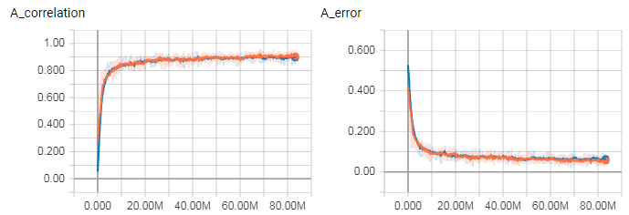

The idea is to build a DCNN that would answer one question:
is the group safe? More precisely, it will tell whether
the group cannot be captured if the opponent starts
and can recapture any ko. For example, the group below
is unsafe, so the DCNN should return a negative number
for the single black stone:

The safety status of the group can be defined as

=\min_{m}\max_{r}{f(B+m+r)})

Assuming the target group is white, `f(B)` can be computed
by letting black play move `m`, then letting white defend
with move `r`. Black tries to minimize the chances of the
white group to live and white tries to maximize these chances.
The [DFS solver](http://github.com/d180cf/tsumego.js)
essentially does this - it recursively computes the value of `f(B)`.
The point of the DCNN is to predict this value.

Currently, the best result is 95.6% accuracy:

This is achieved with a simple NN that consists of just 1 residual block:

1. Input: `[11, 11, F]` where `F = 13` - the number of precomputed features.
2. Alignment with a fully connected layer `[F, N]` where `N = 256` with a `[N]` bias and relu.
3. Only 1 residual block:
    1. The 1st fully connected layer `[N, N]` with a `[N]` bias and relu.
    2. The 2nd fully connected layer `[N, N]` with a `[N]` bias, a skip connection and relu.
4. Readout with a `[N, 1]` fully connected layer, a bias and sigmoid.

The complexity of the NN is limited by the JS performance. Even such
a simple NN needs `11*11*F*N + 2*N*N + N = 0.5 M` multiply-add operations,
so JS on a Core i7 can evaluate the NN only 125 times a second. This is
why it's hard to squeeze a typical `3x3` convolution here: one `3x3`
layer with `64` filters would take `(11*3*64)**2 = 4.5 M` flops, a residual
block needs two such layers at least and a decent DCNN needs at least a few
residual blocks. It also appears that even such a residual tower cannot get
beyond the 96% accuracy.

This NN was trained without batch normalization: it made training faster,
but introduced extra complexity without increasing final accuracy.

# Features

The input to the DCNN will be a list of planes with features
or in other terms in will be a tensor of shape `[N, N, F]`
where `F` is the number of features and `N x N` is the area
that these features are computed for. A reasonable choice would
be `11 x 11` or `9 x 9` because most tsumegos fit in this area.

The features are:

1. a plane of all 0s and a plane of all 1s: when zero padded, the two planes tell where the board edges are
1. stone color: same as the target stone and of the opposite color
1. stone belongs to the target group
1. group size (4 planes)
1. the number of liberties (4 planes)
1. the intersection is a 1-point sure eye

More features to be implemented:

1. the intersection can be an eye (it can be an eye if it doesn't have adjacent stones of the opposite color)
1. stone can be captured in a ladder (aka the lambda-1 sequence)
1. stone can be captured with a net (aka the lambda-2 sequence)
1. location is the center of a nakade shape
1. safe group, i.e. stone belongs to the outer wall or to an alive shape
1. better eyeshape detection
1. the Euler number

# Design

This set of feature tensors is fed to a Python script that uses
[TensorFlow](http://github.com/tensorflow/tensorflow) to find the DCNN parameters.
Once the DCNN parameters are found, they can be exported to a file and the tsumego
solver can use [keras.js](http://github.com/transcranial/keras-js) or [WebDNN](http://github.com/mil-tokyo/webdnn)
to evaluate the board and refine the search. The DCNN can be quickly trained on [AWS](http://aws.amazon.com/tensorflow).

A typical DCNN consist of a few
convolution layers of size `3x3:16:16` (the number of filters is TBD, but the
kernel size `3x3` is pretty much standard and is used in state-of-the-art programs like [AGZ](http://deepmind.com/blog/alphago-zero-learning-scratch/)).
Applying such a convolution to an input image stack of size `7x7:16` needs `7x7x3x3x16x16 = 112K`
multiplications-additions and if there are 3-4 layers this number grows to `500K`
which might seem a lot, but it turns out the the current JS V8 makes `~50 M/s` so it
can apply this convolution `100` times a second. This doesn't take into account the fact
that in web it can use multiple threads (web workers) and GPU (weblas, keras.js, etc.).

There are quite a few possible NN designs:

1. [All conv kernels mixed together](http://www.cs.cityu.edu.hk/~hwchun/research/PDF/Julian%20WONG%20-%20CCCT%202004%20a.pdf)
2. [AlphaGoZero-style NN: 40 residual blocks with batch norm](http://www.nature.com/articles/nature24270.epdf?author_access_token=VJXbVjaSHxFoctQQ4p2k4tRgN0jAjWel9jnR3ZoTv0PVW4gB86EEpGqTRDtpIz-2rmo8-KG06gqVobU5NSCFeHILHcVFUeMsbvwS-lxjqQGg98faovwjxeTUgZAUMnRQ)

# Training

There is a set of 100 or so handmade (well, mostly taken from goproblems.com) tsumegos with proper outer wall and marked target. They are stored in the `sgf-problems` module.

`npm run solve-all` solves each tsumego and outputs a tree of subproblems. When generating the tree the script picks moves that change the safety status of the target group. Every node (not just leafs) in this tree is a subproblem. This step takes a while, but its output is compact.

`npm run vplay-all` plays out all the moves in the tree and generates a separate SGF file for each node. Each subproblem is labeled with `TS[1]` if the target group is safe. Also, `npm run stats` prints how many boards have safe or unsafe target per board size:

size |    safe |  unsafe
---- | ------- | -------
   0 |       0 |    3196
   1 |    1968 |   11768
   2 |    8569 |   24258
   3 |   23069 |   36662
   4 |   44738 |   44791
   5 |   41719 |   44377
   6 |   43741 |   31277
   7 |   21476 |   22465
   8 |   15373 |    8902
   9 |    4532 |    5070
  10 |    2307 |     981
  11 |     518 |     517
  12 |     114 |      47
  13 |      39 |      22

Boards with too few available moves can be ignored as it's easier to run the usual DFS will be faster on such boards. There are about 80K boards with 7+ available moves - a good enough training set.

`npm run validate` verifies the `TS[1]` labels. It picks a small percentage of SGF files, solves them and checks if the status is correct. This step is optional.

`npm run features` computes feature planes for all subproblems. It outputs a JSON file with feature planes and metadata for each subproblem. The feature planes tensor has the shape of `[board.size + 2, board.size + 2, F]` where `F` is the number of features. The point is to later extract `N x N x F` subtensors around the target stone.

`npm run make-tfrs` packs the JSON files into two `.tfrecords` files: 10% goes into `test.tfrecords` and 90% goes into `main.tfrecords`. Both files combined are less than 50 MB (4 MB if zipped).

`npm run dcnn` reads the two datasets, for every record takes an area of size `N x N` around a stone in the target block. The result is a feature tensor of known shape: `[N, N, F]` where `N x N` is the chosen size of the sliding window and `F` is the number of features. There are also 8 symmetries generated by rotation and transposition and there are usually several stones in the target block, so the number of feature tensors that can be extracted from a JSON file is `T x 8` where `T` is the size of the target block.

`npm run tensorboard` can be used to monitor the learning process.

# Inference

`npm run eval` reads the JSON file with DCNN weights, reconstructs the NN, reads SGF files and applies the DCNN to them. Here is error rates by tsumego size:

size  | error | count
----- | ----- | -----
2     | 0.071 | 14
3     | 0.018 | 335
4     | 0.015 | 3332
5     | 0.025 | 17673
6     | 0.034 | 42728
7     | 0.063 | 34385
8     | 0.038 | 21451
9     | 0.043 | 9004
10    | 0.013 | 3157
11    | 0.013 | 1021
12    | 0.056 | 161
13    | 0.000 | 61

The strange maximum around 7 must be related to the fact that the DCNN was trained on tsumegos with 7+ available moves.

# Compression

It's [known](http://arxiv.org/pdf/1701.00485.pdf) that in many cases reducing precision of the weights doesn't reduce much accuracy of the NN.

bits | error
---- | -----
   5 | 0.04
   4 | 0.06
   3 | 0.45
   2 | 0.50

Indeed, just 5 bits per weight is enough to retain the original accuracy.
This means that this NN fits into `5 * (11*11*F*N + 2*N*N) = 325 KB`.

`npm run compress` reduces takes only 5 bits from each weight and writes the
truncated NN to `.bin/tf-model.json`.

There are interesting [ideas](https://arxiv.org/pdf/1603.05279.pdf) how weights
can be reduced to 1-2 bits by using a scaling factor `W[i] -> alpha * sign(W[i])` to compensate the loss of
precision, but I couldn't make it work without dramatic loss of accuracy.

# Results

This is a problem [rated as 9 dan](http://goproblems.com/13083) on goproblems.com:

Green means the stone is likely to survive even if the opponent starts.
Red means the stone is likely to die if the opponent starts.
The solution here is white plays at `B2` or `A2` to capture the group.

On the original setup, the NN thinks that the black stones are dead.
It also thinks that playing at `A1` doesn't help saving the group.
However a stone at `B2` is likely to save the group.

This evaluation is confirmed by the solver, but it needs more than a minute to do that,
while the NN takes a few milliseconds for the entire board.

# Publishing

`npm run webpack` takes NN weights from `.bin/tf-model.json` and merges them with a few JS files
that evaluate the NN. The output is written to `.bin/dcnn.js`. Then `npm publish` uploads the file
to NPM.
