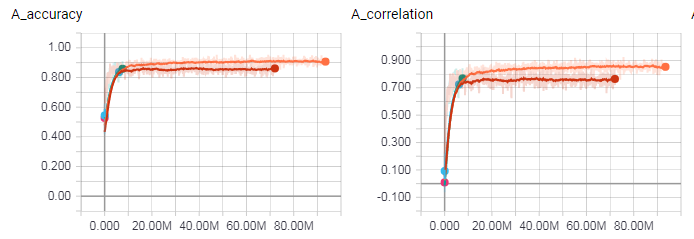

The idea is to build a DCNN that would answer one question:
is the group safe? More precisely, it will tell whether
the group cannot be captured if the opponent starts
and can recapture any ko. For example, the group below
is unsafe, so the DCNN should return a negative number
for the single black stone:


Currently, the best result is 91% accuracy on problems with
7 or more available moves. This is achieved with a stack of
3 residual blocks with 64 outputs each. Note, that a random
number generator would have 50% accuracy because there are
only two outputs.


It's interesting that this result was achieved with a fixed
learning rate `0.5`. When a decay was applied - that halves the
learning rate every `1M` samples - the final accuracy was only
85%.



# Features

The input to the DCNN will be a list of planes with features
or in other terms in will be a tensor of shape `[N, N, F]`
where `F` is the number of features and `N x N` is the area
that these features are computed for. A reasonable choice would
be `11 x 11` or `9 x 9` because most tsumegos fit in this area.

The features are:

- location is outside the board
- stone is black
- stone is white
- stone is in atari, i.e. it has only 1 liberty
- stone has adjcent stones of the same color

More features to be implemented:

- stone can be captured in a ladder (aka the lambda-1 sequence)
- stone can be captured with a net (aka the lambda-2 sequence)
- location is the center of a nakade shape
- safe group, i.e. stone belongs to the outer wall or to an alive shape
- some sort of eye-detection, heuristics and so on

# DCNN

This set of feature tensors is fed to a Python script that uses
[TensorFlow](https://github.com/tensorflow/tensorflow) to find the DCNN parameters.
Once the DCNN parameters are found, they can be exported to a file and the tsumego
solver can use [keras.js](https://github.com/transcranial/keras-js) or [WebDNN](https://github.com/mil-tokyo/webdnn)
to evaluate the board and refine the search. The DCNN can be quickly trained on [AWS](https://aws.amazon.com/tensorflow).

A typical DCNN consist of a few
convolution layers of size `3x3:16:16` (the number of filters is TBD, but the
kernel size `3x3` is pretty much standard and is used in state-of-the-art programs like [AGZ](https://deepmind.com/blog/alphago-zero-learning-scratch/)).
Applying such a convolution to an input image stack of size `7x7:16` needs `7x7x3x3x16x16 = 112K`
multiplications-additions and if there are 3-4 layers this number grows to `500K`
which might seem a lot, but it turns out the the current JS V8 makes `~50 M/s` so it
can apply this convolution `100` times a second. This doesn't take into account the fact
that in web it can use multiple threads (web workers) and GPU (weblas, keras.js, etc.).

There are quite a few possible NN designs:

1. [All conv kernels mixed together](http://www.cs.cityu.edu.hk/~hwchun/research/PDF/Julian%20WONG%20-%20CCCT%202004%20a.pdf)
2. [AlphaGoZero-style NN: 40 residual blocks with batch norm](https://www.nature.com/articles/nature24270.epdf?author_access_token=VJXbVjaSHxFoctQQ4p2k4tRgN0jAjWel9jnR3ZoTv0PVW4gB86EEpGqTRDtpIz-2rmo8-KG06gqVobU5NSCFeHILHcVFUeMsbvwS-lxjqQGg98faovwjxeTUgZAUMnRQ)

# How inputs to DCNN are generated

There is a set of 100 or so handmade (well, mostly taken from goproblems.com) tsumegos with proper outer wall and marked target. They are stored in the `sgf-problems` module.

`npm run solve-all` solves each tsumego and outputs a tree of subproblems. When generating the tree the script picks moves that change the safety status of the target group. Every node (not just leafs) in this tree is a subproblem. This step takes a while, but its output is compact.

`npm run vplay-all` plays out all the moves in the tree and generates a separate SGF file for each node. Each subproblem is labeled with `TS[1]` if the target group is safe. Also, `npm run stats` prints how many boards have safe or unsafe target per board size:

```
size   safe unsafe
------------------
   0      0   3196
   1   1968  11768
   2   8569  24258
   3  23069  36662
   4  44738  44791
   5  41719  44377
   6  43741  31277
   7  21476  22465
   8  15373   8902
   9   4532   5070
  10   2307    981
  11    518    517
  12    114     47
  13     39     22
```

Boards with too few available moves can be ignored as it's easier to run the usual DFS will be faster on such boards. There are about 80K boards with 7+ available moves - a good enough training set.

`npm run validate` verifies the `TS[1]` labels. It picks a small percentage of SGF files, solves them and checks if the status is correct. This step is optional.

`npm run features` computes feature planes for all subproblems. It outputs a JSON file with feature planes and metadata for each subproblem. The feature planes tensor has the shape of `[board.size + 2, board.size + 2, F]` where `F` is the number of features. The point is to later extract `N x N x F` subtensors around the target stone.

`npm run make-tfrs` packs the JSON files into two `.tfrecords` files: 10% goes into `test.tfrecords` and 90% goes into `main.tfrecords`. Both files combined are less than 50 MB (4 MB if zipped).

`npm run dcnn` reads the two datasets, for every record takes an area of size `N x N` around a stone in the target block. The result is a feature tensor of known shape: `[N, N, F]` where `N x N` is the chosen size of the sliding window and `F` is the number of features. There are also 8 symmetries generated by rotation and transposition and there are usually several stones in the target block, so the number of feature tensors that can be extracted from a JSON file is `T x 8` where `T` is the size of the target block.
